# Hey there👋

> "Talk is cheap. Show me the code." – Linus Torvalds

</a>

  

  

## About Me
🎓 pursuing M.Sc Integrated Data Science at PSG COLLEGE OF TECHNOLOGY. 
👨‍💻 I am passionate about Data Science, Machine Learning and I keep learning new things. 
📖 I am currently learning AI AGENTS  
📬 You can contact me through email - akashkumar060303@gmail.com

## Technologies
### Language:

###  Data Analytics

  
  
  
  
  
  
  
  

### Design:

### Cloud & Development Tools:

## GitHub Stats

	
  

## 🏆 GitHub Trophies

  

  
Visitor Count

	

## 😂 Here is a random joke that'll make you laugh!

